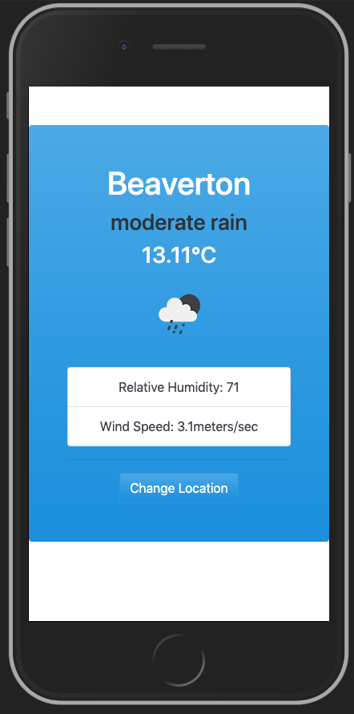

# JS.WeatherApp

#### June 2020

#### By _**Marc Davies**_

# Table of Contents

<!--ts-->

- [Description](#description)
- [Technologies Used](#technologies-used)
- [Setup and Installation](#setup-and-installation)
- [Known Bugs](#known-bugs)
- [Support And Contact Details](#support-and-contact-details)
<!--te-->

## Description

Application which uses the OpenWeather API to return a location's temperature, humidity and wind conditions.

## Technologies Used

- _HTML 5_
- _Bootstrap 4.5.0_
- _jQuery 3.5.1_
- _Javascript_

## Setup and Installation

- Launch your terminal.
- `cd desktop` Navigate to the desktop.
- `git clone "https://github.com/MarcLignarius/JS.WeatherApp"` Clone this repository to your desktop.
- `cd JS.WeatherApp` Open up the cloned repository.
- `open index.html` to open the application in your browser.

Alternatively, visit https://marclignarius.github.io/JS.WeatherApp/ to see the live version of the application.

## Known Bugs

There are no known bugs as of that last release.

## Support and Contact Details

Please contact me via <a href="https://www.linkedin.com/in/marcdaviesriot/">LinkedIn</a> if you have any questions. Your feedback is always welcomed!

Copyright (c) 2020 **_Marc Davies_**
